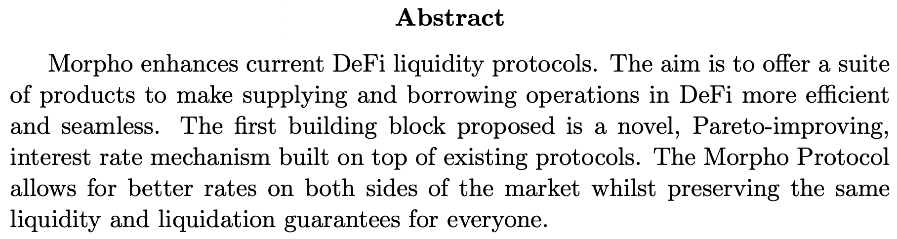
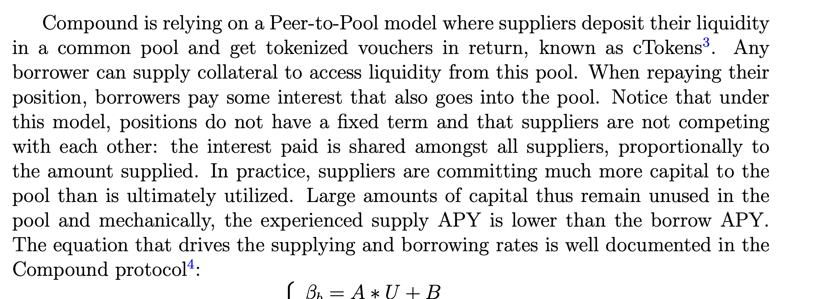
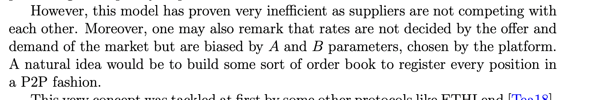
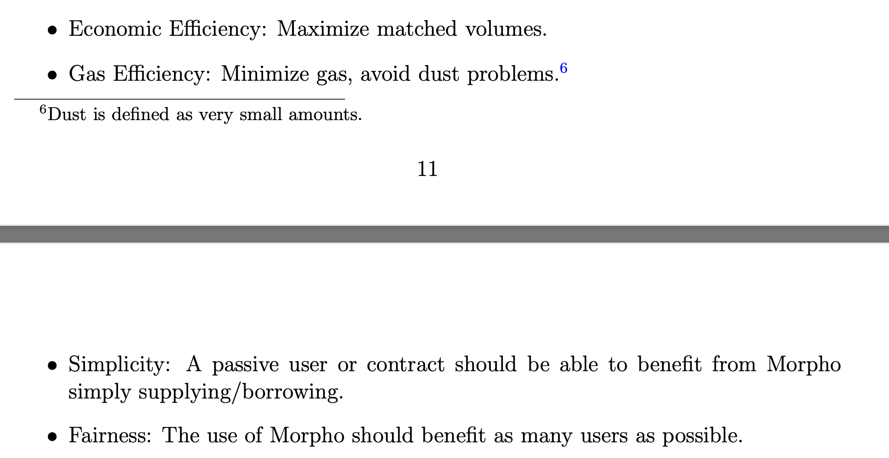
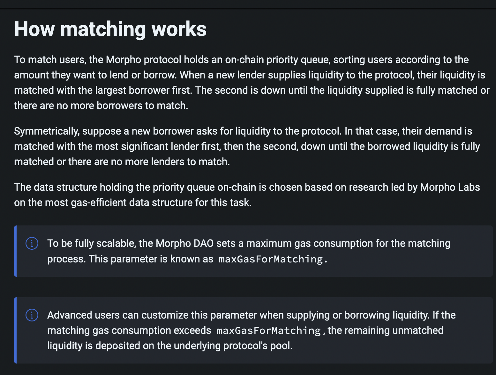
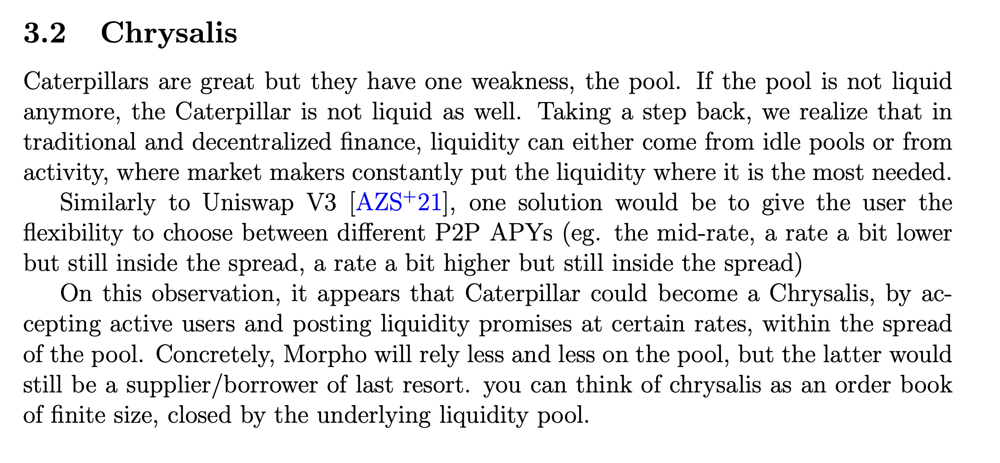
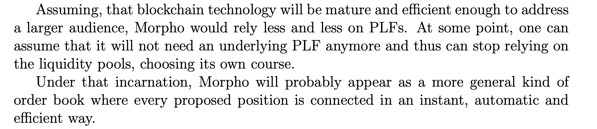

# Morpho Whitepaper Notes <!-- omit in toc -->

## Contents <!-- omit in toc -->

- [The Morpho Opportunity](#the-morpho-opportunity)
- [Advantages of Aggregated Lending](#advantages-of-aggregated-lending)
- [Underlying Venue Liquidity Risk](#underlying-venue-liquidity-risk)
  - [Volt Protocol Migitations](#volt-protocol-migitations)
  - [The Future of Morpho; Beyond Lending Pools](#the-future-of-morpho-beyond-lending-pools)

# The Morpho Opportunity

In preparation for integration with Morpho, I'm doing a read through of their [whitepaper](https://whitepaper.morpho.xyz) and docs. It's very accessible and anyone reading this to read it yourself in full. This document contains my notes and analysis.

One thing that's made clear from is that the Morpho of today is just the beginning! Short duration secured lending, such as in the 3 trillion dollar US repo market, is one of the most natural parts of the financial system to move on chain in the near future and take advantage of greatly reduced settlement costs. Traditional systems with limited operating hours (overnight risk) and higher switching costs should give way to always online, minimal friction public alternatives.

The endgame here is not an arbitrary rate or interest curve, but one that emerges from market supply and demand. This is what we're working on with the new VOLT rate as part of market governance, as well as around VCON holders being able to price assets and market make with orders.

The main advantage of a pool model is the simple and reliable user experience around liquidity. Instead of lenders needing to actively manage their own liquidity, the pool's interest rate model ensures that there are(almost) always sufficient funds liquid for them to withdraw. The downside is that maintaining a target amount of idle liquidity means less profits to lenders and higher rates for borrowers, an overall less than efficient market.

Morpho's peer to peer engine is at least as liquid as the underlying market, so long as its size does not exceed that market. However, peer to peer matching at large scale can indeed break atomic liquidity. Morover, as described below, a system where lenders can compete on rates will improve market outcomes.

# Advantages of Aggregated Lending

Much like the transition from Uniswap v2 to Uniswap v3, this is a major step forward but also signficant complexity for many users to manage actively, and is only gas efficient for positions above a certain size.

Lenders can benefit by socializing as in the case of Volt Protocol. The many small and large VOLT holders mint VOLT in exchange for capital that the system will allocates through VCON market governance, with the goal of obtaining optimized yield. VOLT has liquidity management built in with a VOLT rate that adjusts based on the size of the surplus buffer such that excess redemption demand results in rate increases and vice versa.

By holding a mix of liquidity profiles including portions of fully liquid reserves, VOLT protocol can offer a better experience to yield-seekers than lending directly.

The design considerations around P2P matching are interesting, and I'm curious whether the Morpho team will explore alternative models in future iterations. The whitepaper doesn't quite maker clear how the matching engine works, but the docs are more informative.

As you can see, this means that larger lenders are likely to enjoy higher yield on Morpho as a result of taking precedence in the priority queue and spending more time fully peer to peer matched. This can be considered fair because it is also more costly for borrowers to have to iterate over a larger number of suppliers. The fewer they have to look over to make a successful peer to peer match, the lower the costs of the system and the higher the peer to peer rate. This naturally leads to a process where matches occur until it reaches the marginal user size where it is no longer profitable to do so, or more likely all the demand on one side is satisfied.

VOLT holders would benefit from higher rates on Morpho than they would depositing into the platform individually.

# Underlying Venue Liquidity Risk

Morpho-Compound v2 does not add any market risk to the underlying venue, unless as mentioned above it is larger than the underlying venue and the p2p matching instills liquidity risk.

Liquidity risk can however arise from the underlying venue itself, and is worth thinking about for Morpho lenders. In the event of a liquidation failure that exceeded the reserves' capacity to absorb, or any kind of successful attack that resulted in loss of funds, a race condition is created between Compound suppliers. Those who are first to withdraw take no loss, those who are too late cannot withdraw at all.

## Volt Protocol Migitations

Volt Protocol has features intended to allow emergency removal of funds in a venue in the event of losses or heightened risk conditions, and we are working on an expanded PCV Sentinel System by which any MEV searcher can be rewarded for providing evidence of bad debt positions and triggering the removal of PCV from venues.

The objective of these features is to prevent loss to VOLT holders if possible, and if not ensure that losses are fairly socialized among VOLT holders. The system will seek to prevent sophisticated actors, or those who are simply fortunate to be awake at the time of market volatility or exploit, from avoiding losses while holders who are slower to respond bear the brunt.

## The Future of Morpho; Beyond Lending Pools

The Morpho team has of course put consideration into the same liquidity risks and scaling constraints. Allowing active market making within their book means lenders could demand as high a rate as needed to attract "replacement liquidity" and allow themselves to exit, or encourage borrowers to repay.

Directional orders rather than static or bidirectional pools are the future. The Volt Protocol swaps module designs draw on the same line of thought, where instead of paying DEX swap fees when exchanging stablecoins, VCON holders will market make and continue generating yield while waiting for their orders to fill.